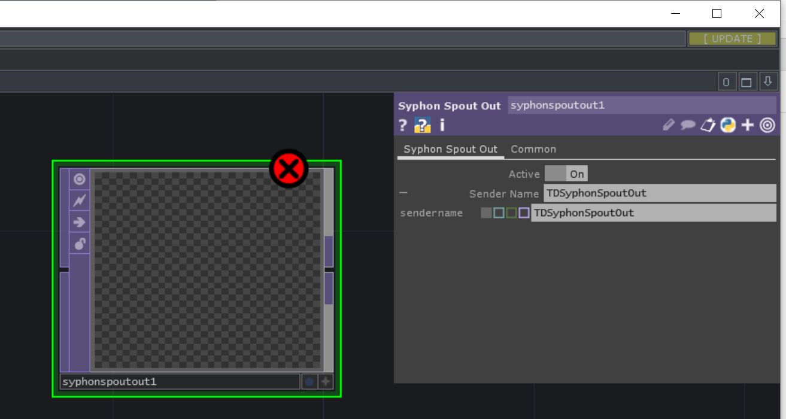
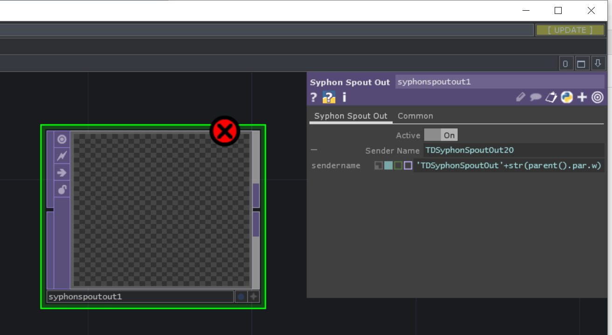

## memo

オペレータのパラメータには入力形式があり, python数式やparant(), digitsなどの関数を使いたい場合は, 白い四角い箱である`expression`をONにする必要があることに注意

- expression: off

- expression: on

## ref

DATs | TouchDesigner 日本語ドキュメント
http://ted-kanakubo.com/touchdesigner-jp/?page_id=326

[ TouchDesigner ] 親オペレータの名前からID番号を取得する | 映像とその周辺
https://www.kalium.net/image/2018/04/16/td%E3%81%A7%E8%A6%AA%E3%82%AA%E3%83%9A%E3%83%AC%E3%83%BC%E3%82%BF%E3%81%AE%E5%90%8D%E5%89%8D%E3%81%8B%E3%82%89id%E7%95%AA%E5%8F%B7%E3%82%92%E5%8F%96%E5%BE%97%E3%81%99%E3%82%8B/

touchdesigner 文字数 - Google 検索
https://www.google.com/search?q=touchdesigner+%E6%96%87%E5%AD%97%E6%95%B0&oq=touchdesigner+%E6%96%87%E5%AD%97%E6%95%B0&aqs=chrome..69i57j0i333l3.10193j0j7&sourceid=chrome&ie=UTF-8

Pythonで文字列の長さ（文字数）を取得 | note.nkmk.me
https://note.nkmk.me/python-str-len/

TouchDesigner で Python を使ってみよう！(２) | poisson
https://poisson.work/tutorial/touchdesigner/touchdesigner-%E3%81%A7-python-%E3%82%92%E4%BD%BF%E3%81%A3%E3%81%A6%E3%81%BF%E3%82%88%E3%81%86%EF%BC%81%EF%BC%92/

replicator and automatic connection - General TouchDesigner Discussion - TouchDesigner forum
https://forum.derivative.ca/t/replicator-and-automatic-connection/5410

Connector Class - Derivative
https://docs.derivative.ca/index.php?title=Connector_Class

PythonでOP/COMPを制御する - Qiita
https://qiita.com/ToyoshiMorioka/items/192409d2eb02a892932d

TouchDesigner 複数カメラをボタンでスイッチング - Qiita
https://qiita.com/atsonic/items/8aeb32c4933b9f05673b

TouchDesignerでのPython入門（基礎編） - Qiita
https://qiita.com/sanokazuya0306/items/d733b17854a566801d00

TouchDesignerでPythonコードとDAT間で入出力する - Qiita
https://qiita.com/sanokazuya0306/items/5ef4e209cacdccdc0622

TouchDesignerでのPython入門（応用編） - Qiita
https://qiita.com/sanokazuya0306/items/3dfd2cf851b59cb9b89f

TouchDesigner Pythonでoperatorをコントロールする - Qiita
https://qiita.com/chimanaco/items/6db8b1698325242332a9

TouchDesigner Advent Calendar 2017 - Qiita
https://qiita.com/advent-calendar/2017/touchdesigner

TouchDesigner本の表紙の絵の作り方 - Qiita
https://qiita.com/shuheimatsuyama/items/7a8ea3eecc1b8418f340

touch designer book

p304- : python

